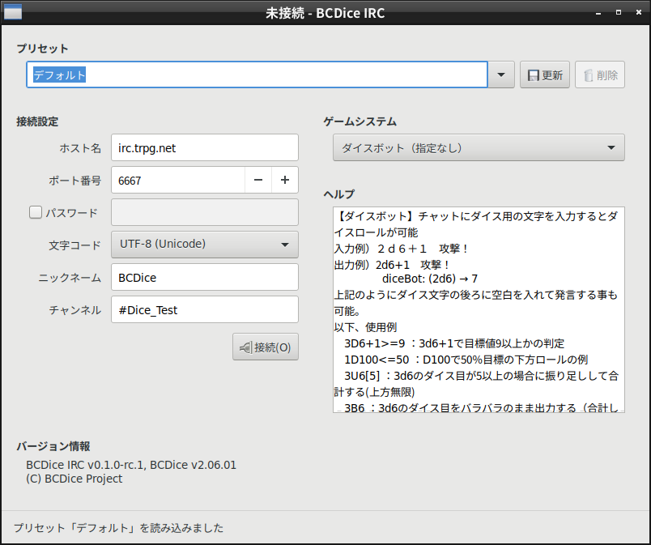

<!--
# @title BCDice IRC
-->
# BCDice IRC

[](https://travis-ci.com/bcdice/bcdice-irc)

BCDice IRCは、TRPG向けダイスエンジン[BCDice](https://bcdice.org/)を搭載したIRCボットです。このボットを使用すると、IRCでのチャットにおいて、ダイスロールをはじめとするBCDiceのオンラインセッション支援機能を利用できます。

## 1. 主な機能

* ダイスロール：2D6などの基本的なダイスロールに加えて、[100種類以上のゲームシステムの固有処理にも対応](https://bcdice.org/systems/)。
* 四則計算：経験値の計算などに。
* プロットの登録・開示
* ポイントカウンタ：イニシアティヴやHP、MP、衝動蓄積など、セッション内で共有したい数値を管理します。
* カード：ゴーストハンターなどの、プレイヤーにカードを配るシステム用の機能。

詳細については、[BCDiceの旧README](https://github.com/bcdice/BCDice/blob/master/docs/README.txt)も参照してください。

## 2. 動作環境

BCDice IRCは、チャットの参加メンバーのうち1人のPCで動作させて使用します。このPCには、以下のソフトウェアが必要です。

* OS：Windows 10（64ビット版）、GNU/Linux、macOSのいずれか（ただし、現在はmacOSでの動作は不安定）
* [Ruby](https://www.ruby-lang.org/) 2.6以降（BCDiceがRubyで書かれているため）
* [GTK](https://www.gtk.org/) 3.10以降（画面表示用のGUIライブラリ）

## 3. 動作に必要な準備

この章では、BCDice IRCの動作に必要な準備の手順を説明します。

### 3.1. Rubyのインストール

BCDiceがプログラミング言語[Ruby](https://www.ruby-lang.org/)で書かれているため、Rubyのインストールが必要です。

Rubyのインストール方法はOSによって大きく異なります。Ruby公式の[インストールガイド](https://www.ruby-lang.org/ja/documentation/installation/)を参照して、Ruby 2.6以降（最新版を推奨）をインストールしてください。

なお、Windows環境では、[RubyInstaller](https://rubyinstaller.org/)を使用して、**x64版**とともにMSYS2-Devkitをインストールする必要があります。GTKライブラリのバグによってキーボード入力に問題が生じるため、**x86版は使用できません**。

### 3.2. macOSにおいてのみ必要な準備

macOSにおいてのみ、以下に述べる追加の準備を行う必要があります。

#### 3.2.1. パッケージ管理システムのインストール

画面表示に必要なGTKライブラリをインストールするために、パッケージ管理システムが必要になります。以下のサイトの案内に従い、パッケージ管理システム「Homebrew」をインストールしてください。

https://brew.sh/

#### 3.2.2 Xウィンドウシステムライブラリのインストール

BCDice IRCの画面を表示するために、Xウィンドウシステムのライブラリをインストールする必要があります。以下のサイトよりライブラリ「XQuartz」をダウンロードして、インストールしてください。

https://www.xquartz.org/

### 3.3. BCDice IRCのダウンロード

[Releases](https://github.com/bcdice/bcdice-irc/releases)ページよりBCDice IRCのアーカイブをダウンロードして、任意のディレクトリに展開してください。

以下では、BCDice IRCの展開先（README.mdやGemfileなどのファイルが含まれているディレクトリ）を `/path/to/bcdice-irc` と書きます（Windows環境の場合は、パスの区切り記号として `\` を使用してください）。

### 3.4. 必要なRuby用パッケージのインストール

BCDice IRCの実行前に、必要なRuby用パッケージをインストールする必要があります。ターミナル（Bash、PowerShell、コマンドプロンプトなど）を使用して、以下のコマンドを実行します。なお、`bundle` コマンドの実行時に管理者権限が必要な場合もあります。

```bash
cd /path/to/bcdice-irc
bundle install
```

画面表示に必要なGTKライブラリがインストールされていない場合は、この作業の間にインストールされます。その際、管理者権限が必要な場合もあります。

## 4. 起動手順

Windows環境において、Rubyのインストール時にファイルの関連付けを行った場合は、BCDice IRC展開先のexeフォルダ内に存在するbcdice-irc-gui.rbをダブルクリックして、BCDice IRCを起動してください。

その他の場合は、ターミナル上で以下のコマンドを実行して、BCDice IRCを起動してください。

```bash
cd /path/to/bcdice-irc
ruby exe/bcdice-irc-gui.rb
```

## 5. 画面および操作の解説

この章では、BCDice IRCの画面および操作方法について解説します。

### 5.1. BCDice IRCの画面

BCDice IRCを起動すると、以下の図1に示す画面が表示されます。



図1：BCDice IRCの画面

### <span id="connecting-to-server">5.2.</span> ボットのIRCサーバへの接続

画面左側の「接続設定」欄では、接続先のIRCサーバ、ニックネーム、および参加するチャンネルについて設定します。また、画面右側の「ゲームシステム」欄では、遊ぶゲームシステムを指定します。その下の「ヘルプ」欄には、使用できるダイスコマンドについての説明が表示されます。

以上の設定を行った後、左側の「接続」ボタンを押すと、ボットがIRCサーバに接続して、指定されたチャンネルに参加します。接続中は、参加中のチャンネルにおいて、ダイスロールなどのオンラインセッション支援機能を利用することができます。

### 5.3. ボットの他チャンネルへの参加

IRCボットを他のチャンネルにも参加させたい場合は、IRCクライアントにおいて `INVITE` コマンドを実行してください。例として、ニックネーム「BCDice」のボットをチャンネル「#Dice_Test2」に参加させたい場合は、以下のように入力して送信します。

```
/INVITE BCDice #Dice_Test2
```

### 5.4. マスターコマンド

ボット宛のプライベートメッセージとしてマスターコマンドを送信すると、BCDiceの詳細な設定を行えます。マスターコマンドの詳細については、「[マスターコマンド](master_commands.md)」を参照してください。

### 5.5. ボットのIRCサーバからの切断

BCDice IRCの画面左側の「切断」ボタン（「接続」ボタンと同じ位置に存在）を押すと、ボットはIRCサーバへの接続を切断します。なお、BCDice IRCの画面を閉じた場合も、接続が切断されます。

### 5.6. プリセット

画面上部の「プリセット」欄では、「[ボットのIRCサーバへの接続](#connecting-to-server)」における設定内容をプリセットとして保存できます。

プリセット名を入力して右側の「保存」ボタンを押すと、新しいプリセットが保存されます。既存のプリセット名を入力した場合は、「保存」ボタンが「更新」ボタンに変わります。このボタンを押すと、既存の設定を更新します。

既存のプリセット名を入力して「削除」ボタンを押すと、保存されたプリセットを削除できます。

プリセット集は、ファイル path/to/bcdice-irc/config/presets.yaml に記録されます。このファイルが存在しない場合は、BCDice IRCの次回起動時に、既定のプリセット集が読み込まれます。プリセットに関連した問題が発生した場合や、既定のプリセット集を復元したい場合は、上記のファイルを削除してください。

## 6. 今後の開発方針

バージョン0の間は、[BCDice v3の開発方針](https://github.com/bcdice/BCDice/blob/master/ROADMAP.md)に合わせて、BCDice本体からダイスロール以外の機能をこのボットに移動することに重点を置いて開発を進める予定です。

バージョン0と並行して開発を行うバージョン1では、従来のBCDiceと同様に、IRCボットを単独の実行ファイルとして実行できるようにすることを目指します。現在のRuby言語では、特に画面表示を含める場合にそれが難しいため、画面表示についてはRuby以外のプログラミング言語を使用して実装することを検討しています。
